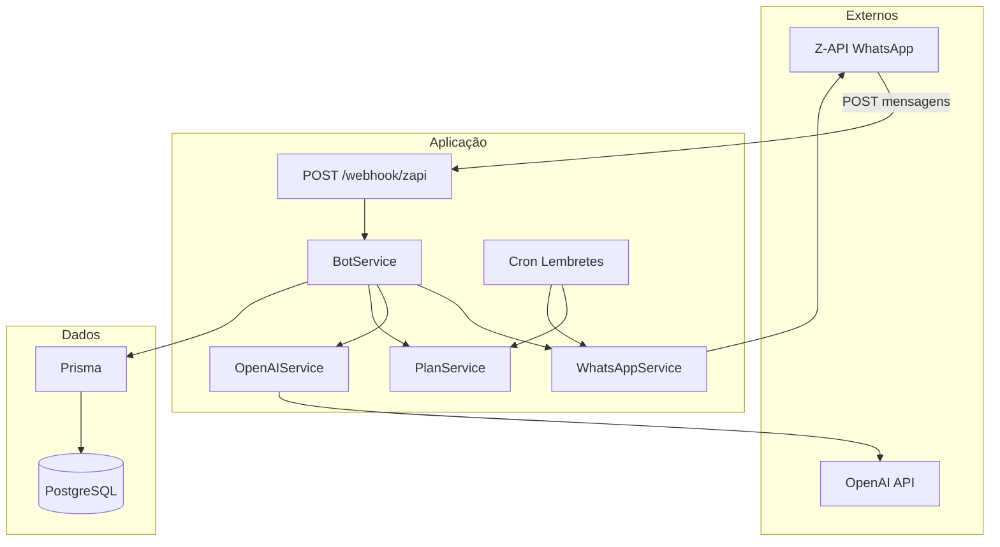

# Plano: MVP Sistema de Lembretes Médicos via WhatsApp

## 1. Visão geral da arquitetura




- **Entrada:** Z-API envia POST para `POST /webhook/zapi` com o payload de mensagem recebida (`phone`, `text.message`, `fromMe`, etc.).
- **BotService:** Decide se é ADMIN (comparando `phone` com `DOCTOR_PHONE`) ou paciente; orquestra cadastro, menus, registro de ações, IA e contato com médico.
- **Saída:** WhatsAppService envia texto via Z-API (`POST .../send-text` com `phone` e `message`).

---

## 2. Estrutura de pastas e arquivos

```
startup-bot-pacientes/
├── prisma/
│   └── schema.prisma
├── src/
│   ├── config/
│   │   └── env.ts
│   ├── controllers/
│   │   └── webhookController.ts
│   ├── services/
│   │   ├── WhatsAppService.ts
│   │   ├── OpenAIService.ts
│   │   ├── PlanService.ts
│   │   └── BotService.ts
│   ├── bot/
│   │   ├── types.ts
│   │   └── states.ts
│   ├── database/
│   │   └── client.ts
│   ├── routes/
│   │   └── index.ts
│   ├── utils/
│   │   └── logger.ts
│   ├── cron/
│   │   └── reminders.ts
│   └── index.ts
├── .env.example
├── .env
├── package.json
├── tsconfig.json
└── README.md
```

---

## 3. Configuração do projeto

### 3.1 package.json

- **Dependências:** `express`, `prisma`, `@prisma/client`, `openai`, `node-cron`, `dotenv`.
- **DevDependencies:** `typescript`, `ts-node`, `@types/node`, `@types/express`, `@types/node-cron`.
- **Scripts:** `"dev": "ts-node-dev --respawn src/index.ts"`, `"build": "tsc"`, `"start": "node dist/index.js"`, `"prisma:generate"`, `"prisma:migrate"`, `"prisma:studio"`.

### 3.2 tsconfig.json

- `target: ES2020`, `module: commonjs`, `outDir: dist`, `strict: true`, `esModuleInterop: true`.

### 3.3 Variáveis de ambiente (src/config/env.ts e .env.example)

- `PORT`, `DATABASE_URL`, `OPENAI_API_KEY`, `ZAPI_BASE_URL`, `ZAPI_INSTANCE_ID`, `ZAPI_TOKEN`, `DOCTOR_PHONE`.
- Validar e exportar em `env.ts`; usar `process.env.DOCTOR_PHONE` (string) para comparar com `phone` do webhook (normalizar para string sem formatação, ex: só dígitos).

---

## 4. Schema Prisma

Arquivo único: `prisma/schema.prisma`.

- **User:** `id` (cuid), `phone` (String, unique), `name` (String?), `role` (enum PATIENT | ADMIN), `createdAt`.
- **PatientProfile:** `id`, `userId` (FK User), `age` (Int?), `condition` (String?), `createdAt`; relação 1:1 com User.
- **Plan:** `id`, `patientId` (FK User), `title`, `createdAt`; 1:N com PlanTask.
- **PlanTask:** `id`, `planId`, `title`, `time` (String, ex: "08:00"), `createdAt`; 1:N com TaskLog.
- **TaskLog:** `id`, `taskId` (FK PlanTask), `date` (DateTime ou Date), `status` (enum DONE | NOT_DONE | REFUSED), `createdAt`.

Provider: `postgresql`. Gerar `npx prisma generate` e migração inicial.

---

## 5. Serviços

### 5.1 database/client.ts

- Instanciar `PrismaClient` e exportar singleton; opcionalmente `prisma.$connect()` no bootstrap.

### 5.2 WhatsAppService (services/WhatsAppService.ts)

- **sendText(phone: string, message: string):** montar URL `ZAPI_BASE_URL/instances/ZAPI_INSTANCE_ID/token/ZAPI_TOKEN/send-text`, POST JSON `{ phone, message }`, header `Content-Type: application/json` (e `Client-Token` se a Z-API exigir). Retornar resposta ou lançar em caso de erro; log no console.
- **parseWebhook(body):** extrair `phone`, texto da mensagem (ex: `body?.text?.message ?? body?.message ?? ''` conforme doc Z-API), `fromMe`; retornar objeto tipado para o bot.

### 5.3 OpenAIService (services/OpenAIService.ts)

- Cliente `openai` com `OPENAI_API_KEY`.
- Método `answerHealthQuestion(question: string): Promise<string>`: chamar chat completion (modelo `gpt-4o-mini` ou `gpt-3.5-turbo`) com system prompt orientando respostas curtas, claras e apenas para dúvidas simples de saúde/cuidados; retornar conteúdo da resposta.

### 5.4 PlanService (services/PlanService.ts)

- **getUserByPhone(phone), createUser(phone, name, role), getOrCreateAdmin(doctorPhone):** CRUD User e PatientProfile.
- **getPatientProfile(userId), updatePatientProfile(userId, { name, age, condition }):** para fluxo de cadastro.
- **getTodayPlan(patientId):** plano ativo do paciente com tarefas (PlanTask); retornar tarefas com horário e título.
- **getTasksDueNow():** tarefas (PlanTask) cujo `time` corresponde ao horário atual (HH:mm), com paciente e plano; usado pelo cron.
- **createPlan(patientId, title, tasks: { title, time }[]):** criar Plan e PlanTasks.
- **updatePlan(planId, tasks):** editar plano (adicionar/remover PlanTasks conforme necessário).
- **getTaskLogsForDate(taskIds, date):** TaskLog por tarefa na data; para status do dia e taxa de adesão.
- **recordTaskLog(taskId, date, status):** criar TaskLog (DONE | NOT_DONE | REFUSED).
- **listPatients(), getPatientStatus(patientId, date):** listar usuários PATIENT; status = tarefas do dia + TaskLog + taxa de adesão (ex: 75%).

### 5.5 BotService (services/BotService.ts)

- **handleIncomingMessage(phone, text):**
  1. Normalizar `phone` (apenas dígitos).
  2. Se `phone === DOCTOR_PHONE`: tratar como ADMIN (menu e comandos do médico).
  3. Senão: buscar User por phone; se não existir, iniciar fluxo de cadastro (estado "cadastro"); se existir e tiver PatientProfile completo, mostrar menu do paciente; se existir mas sem profile, continuar cadastro.
- **Estados do paciente (em memória ou DB):** usar mapa simples em memória `Map<phone, state>` para MVP: estados como `REGISTER_NAME`, `REGISTER_AGE`, `REGISTER_CONDITION`, `MENU`, `AWAIT_ACTION_TASK_ID`, `AWAIT_QUESTION`, `AWAIT_CONTACT_MESSAGE`. Para "Registrar ação", guardar `taskId` no estado e mapear "1"/"2"/"3" para DONE/NOT_DONE/REFUSED; chamar PlanService.recordTaskLog e voltar ao menu.
- **Menu paciente:** enviar texto com opções "1 Ver plano de hoje", "2 Registrar ação realizada", "3 Fazer pergunta para IA", "4 Falar com médico". Tratar "1","2","3","4" conforme especificação.
- **Contato com médico:** ao escolher "4", pedir mensagem; ao receber, WhatsAppService.sendText(DOCTOR_PHONE, `Paciente: ${nome}\nTel: ${phone}\nMensagem: ${msg}`) e confirmar ao paciente.
- **Lembretes:** ao disparar lembrete, enviar "Hora do lembrete" + título da tarefa; opcionalmente definir estado para esse paciente permitindo "1 Fiz", "2 Não fiz", "3 Recusou" para essa taskId e salvar TaskLog.
- **Admin:** se phone === DOCTOR_PHONE, garantir User ADMIN no banco (getOrCreateAdmin). Menu: "1 Listar pacientes", "2 Ver status paciente", "3 Criar plano", "4 Editar plano". Subfluxos: listar (PlanService.listPatients → texto Nome + Telefone); status (pedir identificador ex. telefone, depois PlanService.getPatientStatus e enviar tarefas + adesão); criar plano (pedir telefone, depois lista de tarefas no formato "HH:mm Título" por linha, parse e PlanService.createPlan); editar (pedir plano ou paciente, depois adicionar/remover tarefas).

---

## 6. Webhook e roteamento

- **POST /webhook/zapi:** body raw JSON. Controller chama `WhatsAppService.parseWebhook(req.body)` e, se houver `phone` e não for `fromMe`, chama `BotService.handleIncomingMessage(phone, text)`. Responder 200 rápido para não timeout da Z-API; processar de forma assíncrona se necessário.
- **GET /health** (opcional): retornar 200 para checagem de deploy.

---

## 7. Cron de lembretes (cron/reminders.ts)

- Usar `node-cron` com expressão `'* * * * *'` (a cada minuto).
- No callback: `PlanService.getTasksDueNow()`; para cada tarefa, obter telefone do paciente (via Plan → User) e enviar via WhatsAppService.sendText(phone, `Hora do lembrete\n\n${task.title}`). Opcional: definir estado no BotService para esse paciente aceitar "1/2/3" e gravar TaskLog (ex.: timeout de 5–10 min ou até próxima interação).

---

## 8. Inicialização e médico como ADMIN

- **index.ts:** carregar dotenv, conectar Prisma, registrar rotas (webhook + health), iniciar servidor Express na PORT e registrar cron (importar e chamar função que agenda o job).
- **Admin:** na primeira mensagem recebida do `DOCTOR_PHONE`, chamar `PlanService.getOrCreateAdmin(DOCTOR_PHONE)` (criar User com role ADMIN e phone = DOCTOR_PHONE, name opcional). Sempre que o webhook identificar esse phone, rotear para o menu/comandos do médico.

---

## 9. Detalhes de implementação importantes

- **Normalização de telefone:** remover não dígitos para comparação com DOCTOR_PHONE e para envio à Z-API (formato 5511999999999).
- **Z-API send-text:** POST em `{{ZAPI_BASE_URL}}/instances/{{ZAPI_INSTANCE_ID}}/token/{{ZAPI_TOKEN}}/send-text` com body `{ "phone": "<número>", "message": "<texto>" }`.
- **Persistência de estado do bot:** MVP com `Map<phone, { state, data? }>` em BotService; para produção futura pode-se usar Redis ou campo em User.
- **Criar/editar plano (médico):** entrada de texto livre; parse de linhas no formato "HH:mm Título" (ex.: "08:00 Tomar remédio"); editar = listar tarefas atuais e permitir "adicionar linha" ou "remover número X".

---

## 10. Entregáveis


| Entregável          | Conteúdo                                                                                                                                                                                                                               |
| ------------------- | -------------------------------------------------------------------------------------------------------------------------------------------------------------------------------------------------------------------------------------- |
| Estrutura de pastas | Conforme seção 2                                                                                                                                                                                                                       |
| Código principal    | index.ts, routes, controller, config, database, services, bot (types/states), cron                                                                                                                                                     |
| Schema Prisma       | Modelos User, PatientProfile, Plan, PlanTask, TaskLog com enums e relações                                                                                                                                                             |
| .env.example        | PORT, DATABASE_URL, OPENAI_API_KEY, ZAPI_BASE_URL, ZAPI_INSTANCE_ID, ZAPI_TOKEN, DOCTOR_PHONE                                                                                                                                          |
| README              | Pré-requisitos (Node, PostgreSQL), clone, `npm install`, `.env`, `npx prisma migrate dev`, `npm run dev`; configurar webhook da Z-API para `https://seu-dominio/webhook/zapi`; como testar com médico (número DOCTOR_PHONE) e paciente |


---

## 11. Ordem sugerida de implementação

1. package.json, tsconfig.json, .env.example, config/env.ts.
2. Prisma schema e client; migração.
3. WhatsAppService (sendText + parseWebhook).
4. PlanService (user, profile, plan, task, taskLog).
5. BotService (estados, cadastro, menu paciente, admin, IA, contato médico).
6. OpenAIService.
7. Webhook controller e routes; index.ts (Express + cron).
8. Cron reminders.
9. README e revisão de logs/erros.

O código deve usar TypeScript de forma consistente (tipos para webhook, estados e respostas dos serviços), e manter responsabilidades bem separadas entre serviços para facilitar testes e evolução do MVP.